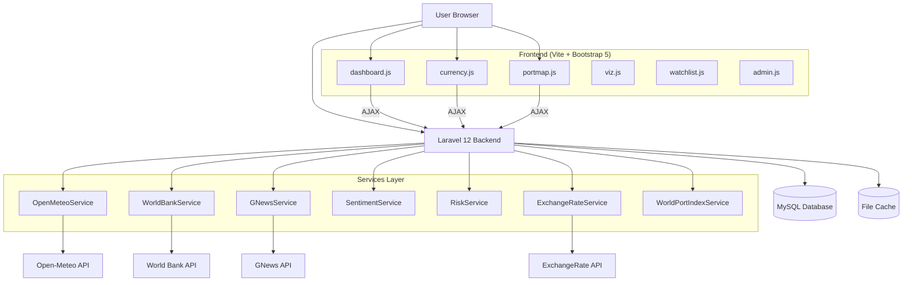
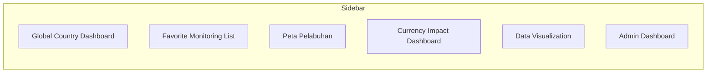
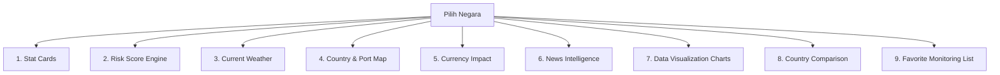
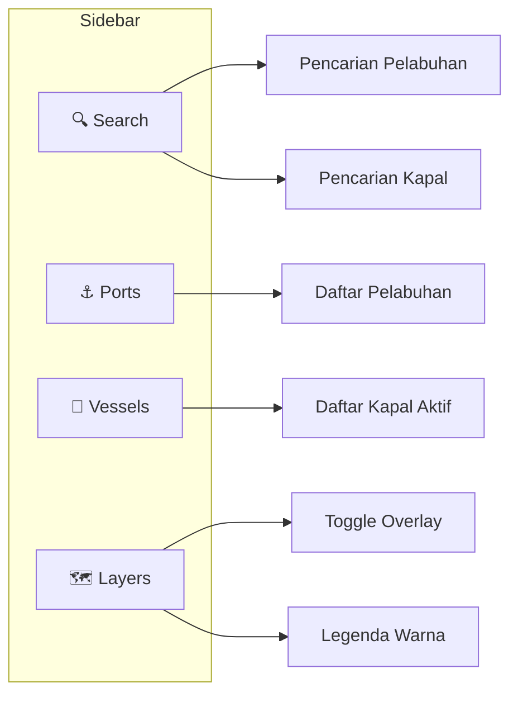
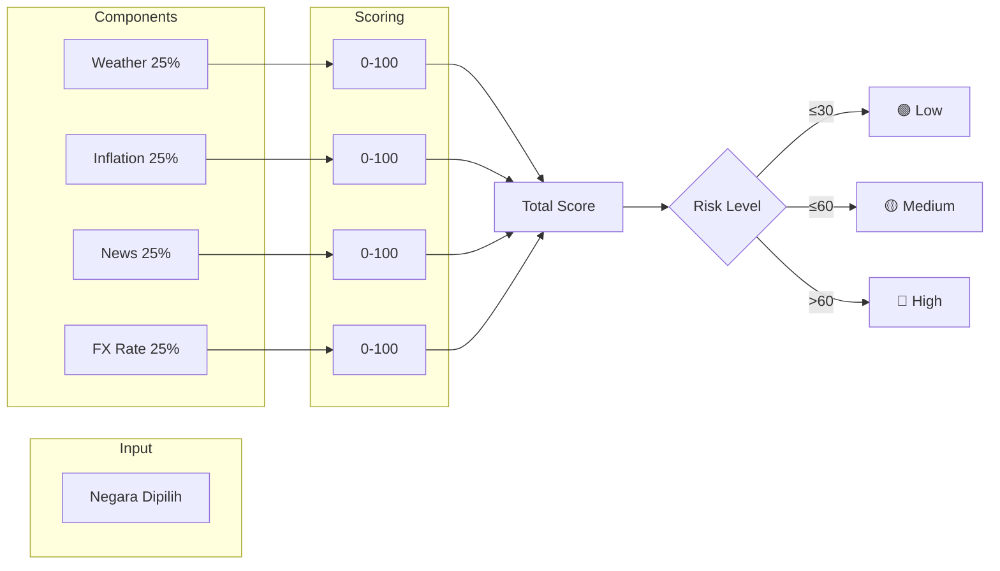

# 🌐 Global Supply Chain Risk Intelligence Platform

**Platform Monitoring Risiko Rantai Pasok Global** — Sistem berbasis web untuk mengagregasi data dari berbagai API eksternal, menghitung skor risiko multi-dimensi per negara, dan menampilkan visualisasi geospasial.

---

## Daftar Isi

1. [Arsitektur Sistem](#1-arsitektur-sistem)
2. [Menu & Fungsinya](#2-menu--fungsinya)
3. [Halaman Dashboard Utama](#3-halaman-dashboard-utama)
4. [Halaman Pendukung](#4-halaman-pendukung)
5. [Risk Scoring Engine](#5-risk-scoring-engine)
6. [Database](#6-database)
7. [API Endpoints](#7-api-endpoints)
8. [External APIs](#8-external-apis)

---

## 1. Arsitektur Sistem



---

## 2. Menu & Fungsinya

Terdapat **6 menu utama** di sidebar kiri:



| No | Menu | Icon | Route | Fungsi |
|----|------|------|-------|--------|
| 1 | **Global Country Dashboard** | `📊` | `/dashboard` | Halaman utama — menampilkan semua data negara (ekonomi, cuaca, risiko, berita, peta, currency) |
| 2 | **Favorite Monitoring List** | `⭐` | `/watchlist` | Daftar negara favorit yang dipantau pengguna |
| 3 | **Peta Pelabuhan** | `🗺️` | `/portmap` | Peta interaktif pelabuhan dunia + tracking kapal real-time |
| 4 | **Currency Impact Dashboard** | `💱` | `/currency` | Grafik tren nilai tukar + tabel kurs real-time |
| 5 | **Data Visualization** | `📈` | `/viz` | Visualisasi data ekonomi multi-negara (GDP, inflasi, currency, risiko) |
| 6 | **Admin Dashboard** | `⚙️` | `/admin` | CRUD untuk port, artikel, user + ringkasan data |

### 2.1 Global Country Dashboard

Halaman utama yang menampilkan **9 seksi data** setelah user memilih negara:



#### Stat Cards (4 buah)

| Stat Card | ID Element | Data | Sumber API |
|-----------|-----------|------|-----------|
| **GDP (USD B)** | `#dash_gdp` | Produk Domestik Bruto dalam miliar USD | World Bank API |
| **Inflation (%)** | `#dash_inflation` | Tingkat inflasi tahunan dalam persen | World Bank API |
| **Population** | `#dash_population` | Jumlah penduduk | World Bank API |
| **Currency** | `#dash_currency` | Kode mata uang negara (USD, EUR, IDR, dll) | Database |

**Cara kerja**: Saat user memilih negara dari dropdown, JS mengirim AJAX ke `/api/countries/{id}`. Data dari World Bank diambil jika belum ada di database, lalu ditampilkan di card. Setiap card memiliki **loader animasi** yang aktif selama proses fetch.

#### Risk Score Engine

Menampilkan skor risiko komposit dengan formula:

```
Total = (Weather × 25%) + (Inflation × 25%) + (News × 25%) + (FX Rate × 25%)
```

| Komponen | ID Element | Bobot | Warna |
|----------|-----------|-------|-------|
| Weather Risk | `#dash_rWeather` | 25% | Info (biru muda) |
| Inflation Risk | `#dash_rInflation` | 25% | Warning (kuning) |
| News Sentiment Risk | `#dash_rNews` | 25% | Primary (biru) |
| FX Rate Risk | `#dash_rCurrency` | 25% | Success (hijau) |

Hasil akhir: **Low** (≤30), **Medium** (≤60), **High** (>60).

#### Current Weather

Data cuaca **real-time** dari Open-Meteo API (gratis, tanpa API key):
- 🌡️ **Temperature** — suhu dalam °C
- 🌧️ **Precipitation** — curah hujan dalam mm
- 💨 **Wind Speed** — kecepatan angin dalam km/h
- ⛈️ **Storm Risk** — risiko badai (Low/Moderate/High)

#### Country & Port Map

Peta **Leaflet.js** dengan OpenStreetMap yang menampilkan:
- 📍 **Lokasi negara** yang dipilih (marker)
- ⚓ **Pelabuhan** di negara tersebut dari World Port Index
- Otomatis zoom ke area yang relevan

#### Currency Impact Dashboard

- **Base Currency Selector**: pilih mata uang dasar (USD, EUR, GBP, JPY, IDR, CNY, SGD, AUD)
- **Bar Chart**: perbandingan nilai tukar terhadap mata uang lain
- **Exchange Rate Table**: tabel kurs real-time

#### News Intelligence

Fitur analisis berita dengan **sentiment analysis**:
- **Keyword Search**: cari berita berdasarkan kata kunci
- **8 Category Filters**: Economy, Logistics, Trade, Shipping, Geopolitics, Inflation, Export/Import, Manufacturing
- **Sentiment Breakdown**:
  - 🟢 Positive — berita positif
  - ⚪ Neutral — berita netral
  - 🔴 Negative — berita negatif
- Daftar artikel dengan label sentimen masing-masing

#### Data Visualization Charts (4 chart)

| Chart | ID | Tipe | Data |
|-------|-----|------|------|
| Economic Profile | `#dash_econRadar` | Radar | GDP, Inflation, Population, Exports, Imports |
| GDP · Exports · Imports | `#dash_tradeChart` | Bar | Perbandingan 3 indikator |
| Risk Component Pie | `#dash_riskPie` | Doughnut | Porsi risiko per komponen |
| Inflation vs GDP | `#dash_dualChart` | Dual Bar | Perbandingan inflasi & GDP |

#### Country Comparison Engine

Membandingkan **2 negara** secara side-by-side:

| Indikator | Negara A | Negara B | Pemenang |
|-----------|----------|----------|----------|
| GDP (USD B) | ✅ | ❌ | ✅ |
| Inflation (%) | ✅ | ❌ | ✅ |
| Risk Score | ✅ | ❌ | ✅ |
| Weather (°C) | ✅ | ❌ | ❌ |
| Currency | ✅ | ❌ | ❌ |

Disertai **Radar Chart** perbandingan visual.

#### Favorite Monitoring List

- Tombol **Add to Watchlist / Remove** untuk menandai negara favorit
- Daftar kartu negara yang dipantau dengan info singkat (GDP, Inflation)

---

### 2.2 Favorite Monitoring List (`/watchlist`)

Halaman untuk mengelola daftar negara favorit:

- **Dropdown negara** + tombol **Add** untuk menambah
- **Kartu grid** menampilkan semua negara yang di-watchlist
- Data: Nama negara, GDP, Inflation
- AJAX CRUD via `/api/watchlist`

---

### 2.3 Peta Pelabuhan (`/portmap`)

Halaman **full-height** dengan MarineTraffic embed + sidebar interaktif:



**Sidebar Tabs**:
1. **Search** — cari pelabuhan (nama/negara) + cari kapal (nama/MMSI/IMO)
2. **Ports** — direktori pelabuhan dengan filter tipe + klik untuk navigasi peta
3. **Vessels** — daftar kapal aktif dengan filter tipe + refresh
4. **Layers** — toggle trade routes, vessels + legenda warna

**Ship Info Panel**: Panel detail kapal saat diklik (Type, Speed, Heading, Route, Destination, Status) dengan tombol Follow, Route Highlight, Untrack.

---

### 2.4 Currency Impact Dashboard (`/currency`)

Halaman analisis nilai tukar:

**Stat Cards** (3):
| Card | Data |
|------|------|
| 💱 Currency | Kode mata uang negara |
| 📊 Latest Rate | Nilai tukar terkini per 1 USD |
| 📈 90-Day Change | Persentase perubahan 90 hari |

**Charts & Tables**:
1. **Exchange Rate Trend** — line chart 90 hari
2. **Snapshot vs Major Currencies** — tabel kurs
3. **Live Cross Rates** — bar chart perbandingan

---

### 2.5 Data Visualization (`/viz`)

Halaman visualisasi multi-negara dengan **4 chart** (2×2 grid):

| Chart | ID | Tipe | Rentang Data |
|-------|-----|------|-------------|
| GDP Trend | `#viz_gdp` | Line chart | 10 tahun |
| Inflation Trend | `#viz_inflation` | Line chart | 10 tahun |
| Currency Trend | `#viz_currency` | Line chart | 90 hari |
| Risk Trend | `#viz_risk` | Line chart | 12 bulan |

Semua chart diperbarui saat user memilih negara dari dropdown.

---

### 2.6 Admin Dashboard (`/admin`)

Halaman administrasi dengan sub-menu:

**Admin Dashboard** (`/admin`):
- **Stat Cards**: Users, Countries, Ports, Articles count
- **Risk Overview Chart**: grafik risiko semua negara
- **Management Links**: Manage Ports, Manage Articles, Manage Users

**Manage Ports** (`/admin/ports`):
- Tabel port dengan CRUD
- Form tambah port: Name, Country, Country Code, Latitude, Longitude, Port Type
- Tipe port: Container, Multi-purpose, Energy, Industrial, Fishing, Passenger, Military

**Manage Articles** (`/admin/articles`):
- Tabel artikel dengan pagination
- Form tambah artikel: Title, Content, Author, Published At

**Manage Users** (`/admin/users`):
- Form create user: Name, Email, Password, Admin checkbox
- Tabel user dengan Role badge + Delete

---

## 5. Risk Scoring Engine

**Lokasi**: `app/Services/RiskService.php`



**Detail Formula**:

| Komponen | Sumber Data | Metrik | Range Skor |
|----------|------------|--------|-----------|
| Weather | Open-Meteo API | Weather code + suhu + angin | 10 – 95 |
| Inflation | World Bank API | Tingkat inflasi tahunan | 10 – 90 |
| News | GNews API | Sentiment analysis (Positive=20, Neutral=50, Negative=75, Crisis=95) | 20 – 95 |
| FX Rate | ExchangeRate API | Coefficient of Variation 30 hari | 15 – 85 |

**Weather Score Detail**:
- Clear: 10 → Cloudy: 25 → Fog: 40 → Light rain: 50 → Heavy rain: 70 → Snow: 75 → Storm: 85 → Thunderstorm: 95
- +15 jika suhu <0°C atau >40°C
- +25 jika angin >50 km/h

**Inflation Score Detail**:
- <2%: 10 → ≤4%: 25 → ≤6%: 50 → ≤8%: 75 → >8%: 90
- +20 jika tren naik >5% YoY
- -15 jika tren turun >5% YoY

**FX Score Detail**:
- CV <1%: 15 → ≤2%: 30 → ≤3%: 50 → ≤5%: 70 → >5%: 85
- +15 jika depresiasi >5%
- -10 jika apresiasi >5%

---

## 6. Database

```mermaid
erDiagram
    countries ||--o{ risk_scores : has
    countries ||--o{ news_cache : has
    countries ||--o{ watchlists : has
    users ||--o{ watchlists : has
    
    countries {
        int id PK
        string name
        string iso_code UK
        string iso_code_3 UK
        string currency_code
        string region
        string language
        float gdp
        float inflation
        bigint population
        float exports
        float imports
    }
    
    risk_scores {
        int id PK
        int country_id FK
        int weather_risk
        int inflation_risk
        int news_sentiment_risk
        int currency_risk
        int total_score
        string risk_level
        datetime calculated_at
    }
    
    news_cache {
        int id PK
        int country_id FK
        string title
        text description
        string source
        string url
        datetime published_at
        string sentiment
    }
    
    ports {
        int id PK
        string name
        string country
        string country_code
        float latitude
        float longitude
        string port_type
    }
    
    watchlists {
        int id PK
        int user_id FK
        int country_id FK
        timestamp created_at
        UNIQUE(user_id, country_id)
    }
    
    users {
        int id PK
        string name
        string email UK
        string password
        boolean is_admin
    }
    
    positive_words {
        int id PK
        string word UK
    }
    
    negative_words {
        int id PK
        string word UK
        string category
    }
    
    vessels {
        int id PK
        int mmsi UK
        int imo
        string name
        string vessel_type
        string flag_country
        float latitude
        float longitude
        float speed
        int course
        int heading
        string destination
        string nav_status
        boolean is_tracked
        datetime last_updated
    }
    
    articles {
        int id PK
        string title
        text content
        string author
        date published_at
    }
```

---

## 7. API Endpoints

### Web API (JSON)

| Method | Endpoint | Controller | Deskripsi |
|--------|----------|-----------|-----------|
| GET | `/api/countries` | CountryController@index | Daftar semua negara (cache 1 jam) |
| GET | `/api/countries/{id}` | CountryController@show | Detail negara + cuaca + data ekonomi |
| GET | `/api/risk` | RiskController@index | Skor risiko (dengan filter country_id) |
| GET | `/api/ports` | PortController@index | Daftar pelabuhan (paginate 50) |
| GET | `/api/news` | NewsController@index | Berita (dengan filter keyword & country_id) |
| GET | `/api/currency` | CurrencyController@index | Nilai tukar (dengan parameter base) |
| GET | `/api/viz/gdp` | VizController@gdp | Series GDP 10 tahun |
| GET | `/api/viz/inflation` | VizController@inflation | Series inflasi 10 tahun |
| GET | `/api/viz/currency` | VizController@currency | Series nilai tukar 90 hari |
| GET | `/api/viz/risk` | VizController@risk | Series risiko 12 bulan |
| GET | `/api/watchlist` | WatchlistController@index | Daftar watchlist user |
| POST | `/api/watchlist` | WatchlistController@store | Tambah ke watchlist |
| DELETE | `/api/watchlist/{countryId}` | WatchlistController@destroy | Hapus dari watchlist |

### Port Map API

| Method | Endpoint | Deskripsi |
|--------|----------|-----------|
| GET | `/api/portmap/ports` | Semua pelabuhan (dengan filter country) |
| GET | `/api/portmap/vessels` | Semua kapal (dengan filter type) |
| GET | `/api/portmap/search-vessels` | Cari kapal (by name/MMSI/IMO) |
| GET | `/api/portmap/vessel-position/{mmsi}` | Posisi kapal spesifik |
| POST | `/api/portmap/track-vessel/{mmsi}` | Track kapal |
| POST | `/api/portmap/untrack-vessel/{mmsi}` | Untrack kapal |

---

## 8. External APIs

| API | Data yang Diambil | API Key | Biaya |
|-----|------------------|---------|-------|
| **Open-Meteo** | Cuaca (suhu, presipitasi, angin, kode cuaca) | Tidak perlu | Gratis |
| **World Bank** | GDP, inflasi, populasi, ekspor, impor | Tidak perlu | Gratis |
| **REST Countries** | Info negara (iso code, region, currency) | ✅ Perlu (free tier) | Gratis |
| **ExchangeRate** | Kurs real-time | ✅ Perlu (free tier) | Gratis |
| **GNews** | Berita ekonomi & logistik | ✅ Perlu (free tier) | Gratis |
| **AISStream.io** | Posisi kapal real-time | ✅ Perlu (free tier) | Gratis |
| **VesselFinder** | Data kapal alternatif | ✅ Perlu (free tier) | Gratis |
| **DataDocked** | Data kapal alternatif | ✅ Perlu (free tier) | Gratis |
| **MarineTraffic** | Peta navigasi (iframe embed) | Tidak perlu | Gratis |

---

## Tech Stack

| Layer | Teknologi |
|-------|-----------|
| **Backend** | PHP 8.2, Laravel 12 |
| **Database** | MySQL |
| **Frontend** | Bootstrap 5, Vanilla JS (ES6 + AJAX) |
| **Build Tool** | Vite 7 |
| **Charts** | Chart.js |
| **Maps** | Leaflet.js + OpenStreetMap |
| **Icons** | Bootstrap Icons |

---

*Dokumentasi ini dibuat pada Juli 2026 untuk Platform Monitoring Risiko Rantai Pasok Global.*
